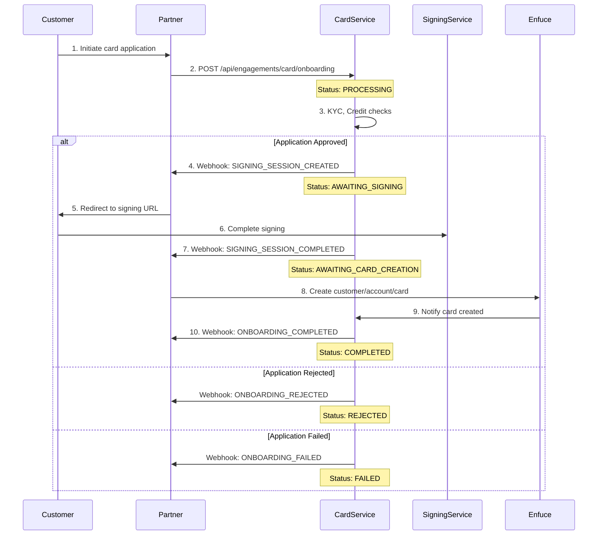

# Integration Flow

This guide walks through the technical integration flow for implementing card onboarding in your application.

## High-Level Process

The card onboarding integration follows a webhook-driven asynchronous pattern, allowing your system to react to state changes in real-time:



## Integration Steps

### Step 1: Initiate Application

Your customer submits their card application through your interface. Collect all required information and submit to Nordiska's Card Service.

### Step 2: Submit to Card Service

Make a POST request to `/api/engagements/card/onboarding` with the applicant's information. The service immediately returns an onboarding ID and begins processing.

### Step 3: Handle Processing

The Card Service performs automated checks:
- KYC verification against PEP and sanctions lists
- Credit scoring through bureau integrations
- Internal risk assessment

This typically completes within 3-10 seconds.

### Step 4: React to Webhooks

Based on the processing outcome, you'll receive one of several webhooks:

- **SIGNING_SESSION_CREATED**: Application approved, redirect customer to sign
- **ONBOARDING_REJECTED**: Application declined, show appropriate message
- **ONBOARDING_FAILED**: Technical issue occurred, handle error gracefully

### Step 5: Document Signing

For approved applications, redirect the customer to the provided signing URL. The signing service handles:
- Document presentation
- Identity verification
- Qualified electronic signature capture

### Step 6: Card Creation

After successful signing, create the card in Enfuce:
1. Create customer record
2. Create account linked to credit facility
3. Order physical/virtual card

### Step 7: Complete Onboarding

Once Enfuce confirms card creation, the onboarding completes and the customer can start using their card.

## State Management


### State Transitions

The onboarding process moves through defined states, each representing a specific phase:

<Steps>
  <Step title="PROCESSING">
    Initial validation and automated checks in progress.
    
    **Duration**: 3-10 seconds
    
    **Next States**:
    - AWAITING_SIGNING (approved)
    - REJECTED (declined)
    - FAILED (error)
  </Step>
  
  <Step title="AWAITING_SIGNING">
    Application approved, waiting for customer signature.
    
    **Duration**: Customer-dependent (max 30 days)
    
    **Actions Required**:
    - Redirect customer to signing URL
    - Monitor for completion webhook
    
    **Next States**:
    - AWAITING_CARD_CREATION (signed)
    - FAILED (signing expired/cancelled)
  </Step>
  
  <Step title="AWAITING_CARD_CREATION">
    Documents signed, ready for card issuance.
    
    **Duration**: Partner-dependent
    
    **Actions Required**:
    - Create Enfuce customer
    - Create Enfuce account
    - Order card
    
    **Next States**:
    - COMPLETED (card created)
    - FAILED (creation error)
  </Step>
  
  <Step title="COMPLETED">
    Onboarding finished successfully.
    
    **Result**:
    - Credit engagement active
    - Card ordered/issued
    - Customer can transact
  </Step>
  
  <Step title="REJECTED">
    Application declined during assessment.
    
    **Reasons**:
    - KYC_DENIAL
    - CREDIT_SCORING_DENIAL
    
    **Customer Action**:
    - KYC issues: Contact support
    - Credit issues: Reapply after 3 months
  </Step>
  
  <Step title="FAILED">
    Technical or validation error occurred.
    
    **Error Codes**:
    - INTERNAL_ERROR
    - ADDRESS_MISMATCH
    - NAME_MISMATCH
    - ID_VERIFICATION_FAILED
    - TIMEOUT
  </Step>
</Steps>

## Webhook Implementation

### Configuration

<Warning>
Webhook endpoints must be configured by your Nordiska integration contact before going live.
</Warning>

### Webhook Events

Your system should handle these webhook events:

#### SIGNING_SESSION_CREATED

Indicates the application is approved and ready for signing.

```json
{
  "eventType": "SIGNING_SESSION_CREATED",
  "onboardingId": "7a0d9433-4f64-4f93-919c-5ab7d81eea55",
  "signingSessionId": "1fa6ef79-16e7-4665-ae78-c885e65e372b",
  "signingUrl": "https://sign.dev.nordiska.com/?sessionId=1fa6ef79-16e7-4665-ae78-c885e65e372b"
}
```

**Your Actions**:
1. Store the signing URL
2. Redirect customer to complete signing
3. Track abandonment for follow-up

#### SIGNING_SESSION_COMPLETED

Customer has successfully signed all documents.

```json
{
  "eventType": "SIGNING_SESSION_COMPLETED",
  "onboardingId": "7a0d9433-4f64-4f93-919c-5ab7d81eea55",
  "signingSessionId": "1fa6ef79-16e7-4665-ae78-c885e65e372b"
}
```

**Your Actions**:
1. Update customer status
2. Initiate Enfuce card creation
3. Send confirmation to customer

#### ONBOARDING_COMPLETED

The entire onboarding process has finished successfully.

```json
{
  "eventType": "ONBOARDING_COMPLETED",
  "onboardingId": "7a0d9433-4f64-4f93-919c-5ab7d81eea55"
}
```

**Your Actions**:
1. Activate customer account
2. Send welcome communications
3. Enable card management features

#### ONBOARDING_REJECTED

Application was declined during assessment.

```json
{
  "eventType": "ONBOARDING_REJECTED",
  "onboardingId": "7a0d9433-4f64-4f93-919c-5ab7d81eea55",
  "rejectReason": "CREDIT_SCORING_DENIAL"
}
```

**Your Actions**:
1. Notify customer of decision
2. Provide next steps or alternatives
3. Log for analytics

#### ONBOARDING_FAILED

A technical error occurred during processing.

```json
{
  "eventType": "ONBOARDING_FAILED",
  "onboardingId": "7a0d9433-4f64-4f93-919c-5ab7d81eea55",
  "failureCode": "ADDRESS_MISMATCH"
}
```

**Your Actions**:
1. Log error for investigation
2. Notify customer if appropriate
3. Provide support contact

### Webhook Security

All webhooks include:
- **HMAC signature** for authenticity verification
- **Timestamp** to prevent replay attacks
- **Idempotency key** for duplicate detection

<CodeGroup>

```javascript Signature Verification
const crypto = require('crypto');

function verifyWebhook(payload, signature, secret) {
  const hmac = crypto.createHmac('sha256', secret);
  const expectedSignature = hmac.update(payload).digest('hex');
  return crypto.timingSafeEqual(
    Buffer.from(signature),
    Buffer.from(expectedSignature)
  );
}
```

```python Signature Verification
import hmac
import hashlib

def verify_webhook(payload, signature, secret):
    expected = hmac.new(
        secret.encode(),
        payload.encode(),
        hashlib.sha256
    ).hexdigest()
    return hmac.compare_digest(signature, expected)
```

</CodeGroup>

## Best Practices

### Asynchronous Processing

- Design your UI to handle the asynchronous nature
- Provide clear status updates to customers
- Implement proper loading and waiting states

### Error Handling

- Gracefully handle all webhook events
- Implement retry logic for transient failures
- Log all interactions for debugging

### Customer Experience

- Show progress indicators during processing
- Provide clear next steps after each state
- Send email/SMS updates for long-running processes

### Monitoring

- Track conversion rates at each step
- Monitor webhook delivery success
- Alert on unusual failure patterns

## Implementation Checklist

<Tabs>
  <Tab title="Development">
    - [ ] Implement onboarding API call
    - [ ] Set up webhook endpoint
    - [ ] Handle all webhook events
    - [ ] Implement signing redirect flow
    - [ ] Add status polling fallback
    - [ ] Create error handling
    - [ ] Add logging and monitoring
  </Tab>
  <Tab title="Testing">
    - [ ] Test successful flow end-to-end
    - [ ] Verify rejection handling
    - [ ] Test error scenarios
    - [ ] Validate webhook security
    - [ ] Check idempotency
    - [ ] Test timeout scenarios
    - [ ] Verify state transitions
  </Tab>
  <Tab title="Production">
    - [ ] Configure production webhooks
    - [ ] Set up monitoring alerts
    - [ ] Implement rate limiting
    - [ ] Add circuit breakers
    - [ ] Configure retry policies
    - [ ] Set up error tracking
    - [ ] Plan incident response
  </Tab>
</Tabs>

---

For detailed API documentation and endpoint specifications, please contact your Nordiska integration specialist. 