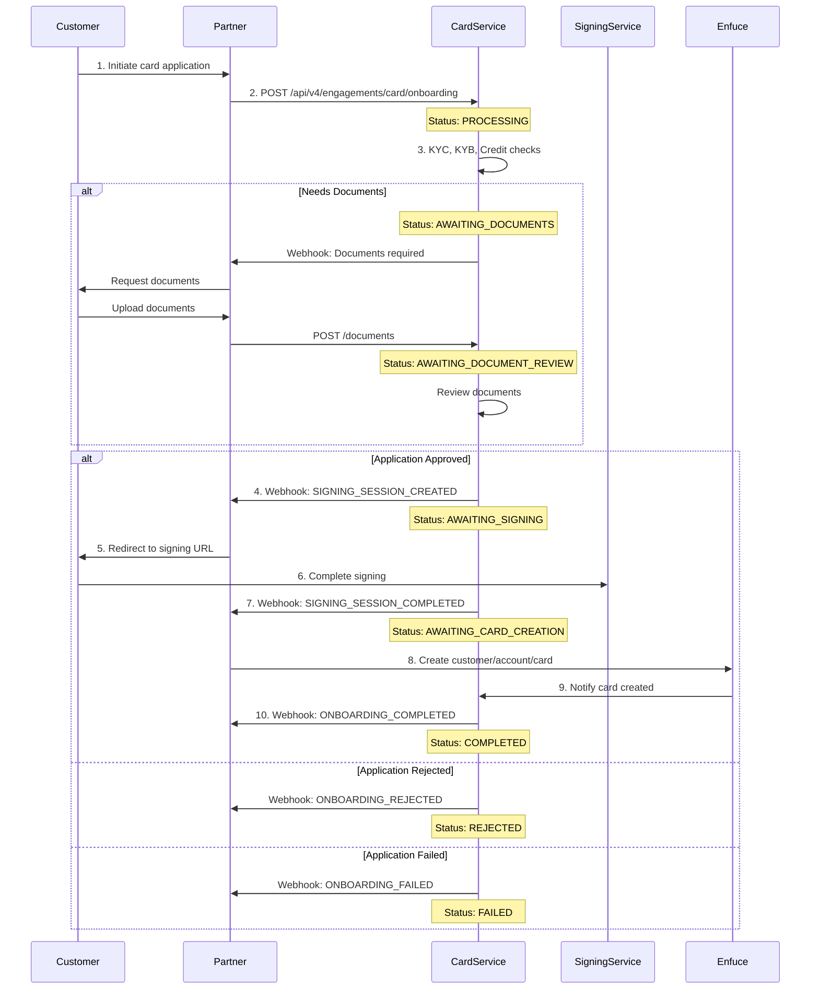

This guide walks through the technical integration flow for implementing card onboarding in your application.

## High-Level Process

The card onboarding integration follows a webhook-driven asynchronous pattern, allowing your system to react to state changes in real-time:

## Integration Steps

### Step 1: Initiate Application

Your customer submits their card application through your interface. Collect all required information and submit to Nordiska's Card Service.

### Step 2: Submit to Card Service

Make a POST request to `/api/v4/engagements/card/onboarding` with the applicant's information. The service immediately returns an onboarding ID and begins processing.

The unified API supports both consumer and business onboarding through the `onboardingType` discriminator field:
- Set `onboardingType` to `"CONSUMER"` for consumer customers
- Set `onboardingType` to `"BUSINESS"` for business customers (requires additional company information)

### Step 3: Handle Processing

The Card Service performs automated checks:
- KYC verification against PEP and sanctions lists
- Credit scoring through bureau integrations (Schufa, Creditsafe for businesses)
- Internal risk assessment
- For businesses: Additional KYB verification and signatory authorization checks

This typically completes within 3-10 seconds.

### Step 3a: Document Upload (if required)

For certain business types, additional documentation may be required. When the status changes to `AWAITING_DOCUMENTS`:

1. Notify the customer that documents are needed
2. Collect the required documents (e.g., tax registration)
3. Upload via `POST /api/engagements/card/onboarding/{onboarding-id}/documents`
4. Status changes to `AWAITING_DOCUMENT_REVIEW`
5. Wait for document review completion

**Document Upload Requirements:**
- Content types: `application/pdf`, `image/*`
- Maximum file size: 10 MB
- Document types: `TAX_REGISTRATION`

### Step 4: React to Webhooks

Based on the processing outcome, you'll receive one of several webhooks:

- **SIGNING_SESSION_CREATED**: Application approved, redirect customer to sign
- **ONBOARDING_REJECTED**: Application declined, show appropriate message
- **ONBOARDING_FAILED**: Technical issue occurred, handle error gracefully

### Step 5: Document Signing

For approved applications, redirect the customer to the provided signing URL. The signing service handles:
- Document presentation
- Identity verification
- Qualified electronic signature capture

### Step 6: Card Creation

After successful signing, create the card in Enfuce:
1. Create customer record
2. Create account linked to credit facility
3. Order physical/virtual card

### Step 7: Complete Onboarding

Once Enfuce confirms card creation, the onboarding completes and the customer can start using their card.

## State Management

### State Transitions

The onboarding process moves through defined states, each representing a specific phase:

<Steps>
  <Step title="PROCESSING">
    Initial validation and automated checks in progress.

    **Duration**: 3-10 seconds

    **Next States**:
    - AWAITING_DOCUMENTS (documents needed)
    - AWAITING_SIGNING (approved)
    - REJECTED (declined)
    - FAILED (error)
  </Step>

  <Step title="AWAITING_DOCUMENTS">
    Additional documentation required from applicant.

    **Duration**: Customer-dependent

    **Actions Required**:
    - Notify customer of required documents
    - Upload documents via POST /api/engagements/card/onboarding/{id}/documents

    **Next States**:
    - AWAITING_DOCUMENT_REVIEW (documents uploaded)
  </Step>

  <Step title="AWAITING_DOCUMENT_REVIEW">
    Documents submitted, under review.

    **Duration**: 1-3 business days

    **Next States**:
    - AWAITING_SIGNING (approved)
    - REJECTED (invalid documents)
  </Step>

  <Step title="AWAITING_SIGNING">
    Application approved, waiting for customer signature.

    **Duration**: Customer-dependent (max 30 days)

    **Actions Required**:
    - Redirect customer to signing URL
    - Monitor for completion webhook

    **Next States**:
    - AWAITING_CARD_CREATION (signed)
    - FAILED (signing expired/cancelled)
  </Step>

  <Step title="AWAITING_CARD_CREATION">
    Documents signed, ready for card issuance.

    **Duration**: Partner-dependent

    **Actions Required**:
    - Create Enfuce customer
    - Create Enfuce account
    - Order card

    **Next States**:
    - COMPLETED (card created)
    - FAILED (creation error)
  </Step>

  <Step title="COMPLETED">
    Onboarding finished successfully.

    **Result**:
    - Credit engagement active
    - Card ordered/issued
    - Customer can transact
  </Step>

  <Step title="REJECTED">
    Application declined during assessment.

    **Reasons**:
    - KYC_DENIAL
    - KYB_DENIAL
    - CREDIT_SCORING_DENIAL
    - UNAUTHORIZED_SIGNATORY (businesses only)
    - INVALID_DOCUMENTS

    **Customer Action**:
    - KYC issues: Our AML team will handle these manually and after review, the user can start new onboarding
    - KYB issues: Business verification failed, contact support
    - Credit issues: Recommend that you let the customer reapply after 3 months with new onboarding
    - Signatory issues: Customer must provide proof of authorization to sign for the business
    - Document issues: Re-upload valid documents

    <Warning>
    For both KYC and credit scoring denials, the current onboarding remains permanently in REJECTED status. Customers must initiate a completely new onboarding process with a new onboarding ID:
    - **KYC denials**: After AML team review and approval
    - **Credit denials**: After 3-month waiting period
    </Warning>
  </Step>

  <Step title="FAILED">
    Technical or validation error occurred.

    **Error Codes**:
    - INTERNAL_ERROR
    - ADDRESS_MISMATCH
    - NAME_MISMATCH
    - ID_VERIFICATION_FAILED
    - TIMEOUT
  </Step>
</Steps>

## Webhook Implementation

The integration relies on webhooks to notify your system of status changes in real-time. When key events occur (approval, signing completion, etc.), Nordiska sends HTTP POST requests to your configured webhook endpoint.

**Key webhook events**:
- **SIGNING_SESSION_CREATED**: Application approved, customer needs to sign
- **SIGNING_SESSION_COMPLETED**: Customer finished signing documents  
- **ONBOARDING_COMPLETED**: Entire process completed successfully
- **ONBOARDING_REJECTED**: Application declined during assessment
- **ONBOARDING_FAILED**: Technical error occurred

<Info>
For complete webhook implementation details, security requirements, and code examples, see our [Webhooks Guide](/card/webhooks).
</Info>

---

For detailed API documentation and endpoint specifications, please contact your Nordiska integration specialist. 