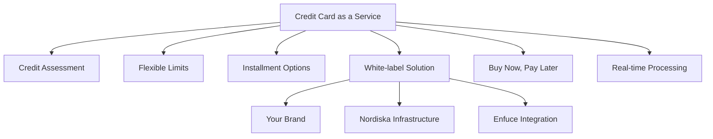

Nordiska's Credit Card as a Service platform enables partners to offer credit cards to their customers under their own brand while leveraging our robust financial infrastructure.

## What is Credit Card as a Service?

Credit Card as a Service is a comprehensive white-label solution that allows businesses to issue credit cards without building their own banking infrastructure. Through our partnership with Enfuce and integration with major payment networks, we handle the complex regulatory, technical, and operational aspects of card issuance.

## Credit Card Features

Our credit card offering includes:
- **Instant credit decisions** powered by automated credit scoring
- **Flexible credit limits** from €500 to €10,000
- **Buy Now, Pay Later** integration for installment purchases
- **Real-time transaction processing** and authorization
- **Interest-free periods** for purchases
- **Revolving credit** with minimum payment options
- **Cash advance** capabilities at ATMs worldwide

## Key Features

<CardGroup cols={2}>
  <Card title="White-Label Solution" icon="palette">
    Issue credit cards under your brand with custom designs while we handle the infrastructure
  </Card>
  <Card title="Regulatory Compliance" icon="shield">
    Full PSD2 compliance, KYC/AML checks, and regulatory reporting handled by Nordiska
  </Card>
  <Card title="Real-time Processing" icon="bolt">
    Instant authorization, balance updates, and transaction notifications
  </Card>
  <Card title="Comprehensive APIs" icon="code">
    RESTful APIs for card management, transactions, and customer onboarding
  </Card>
</CardGroup>

## Credit Management

### Credit Limits
- Automated credit scoring determines initial limits
- Dynamic limit adjustments based on payment behavior
- Temporary limit increases for special purchases
- Real-time available credit updates

### Interest & Fees
- Competitive interest rates
- Transparent fee structure
- Grace periods on purchases
- Cash advance fees clearly communicated

### Payment Options
- Minimum payment calculations
- Full balance payments
- Installment plan conversions
- Automatic payment setup

## Infrastructure Partners

### Enfuce
Our primary card processing partner, Enfuce provides:
- Physical and virtual card production
- Transaction processing and authorization
- Card network connections (Visa, Mastercard)
- Fraud detection and prevention
- 3D Secure authentication

### Payment Networks
Direct integration with major networks:
- **Visa** - Global acceptance at 100+ million locations
- **Mastercard** - Worldwide payment network coverage

## Use Cases

<Tabs>
  <Tab title="E-commerce Platforms">
    Offer customers instant credit at checkout with integrated BNPL options, increasing average order values and conversion rates.
  </Tab>
  <Tab title="Fintech Apps">
    Add credit card issuance to your financial app, providing users with flexible spending power and earning potential through interchange fees.
  </Tab>
  <Tab title="Retail Chains">
    Launch store-branded credit cards with special financing offers, loyalty rewards, and exclusive customer benefits.
  </Tab>
  <Tab title="Travel Platforms">
    Issue travel credit cards with benefits like no foreign transaction fees, travel insurance, and points accumulation.
  </Tab>
</Tabs>

## Getting Started

To begin offering credit cards to your customers:

1. **[Onboarding Process](/card/onboarding)** - Understand the customer onboarding flow
2. **[Integration Guide](/card/integration-flow)** - Technical integration steps
3. **Testing Environment** - Sandbox access for development

## Benefits for Partners

- **Fast Time-to-Market**: Launch credit card programs in weeks, not months
- **No Banking License Required**: Operate under Nordiska's regulatory umbrella
- **Scalable Infrastructure**: Handle millions of cards and transactions
- **Revenue Sharing**: Earn from interchange fees and credit interest
- **Risk Management**: Nordiska handles credit risk and collections
- **24/7 Support**: Dedicated technical and operational support

## Security & Compliance

All credit card operations are secured with:
- **PCI DSS Level 1** certification
- **3D Secure 2.0** for online transactions
- **EMV chip technology** for physical cards
- **Real-time fraud monitoring** with machine learning
- **GDPR-compliant** data handling
- **Consumer Credit Directive** compliance

## Credit Risk Management

Nordiska handles all aspects of credit risk:
- **Automated underwriting** using advanced scoring models
- **Credit bureau integration** (Schufa, UC)
- **Behavioral scoring** for limit adjustments
- **Collections management** for delinquent accounts
- **Fraud prevention** with real-time monitoring

---

Ready to start? Explore our [onboarding process](/card/onboarding) to understand how customers can apply for credit cards through your platform. 