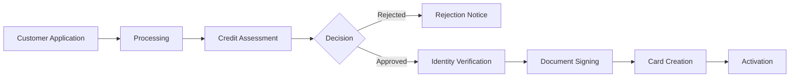

Credit card onboarding is the process through which your customers apply for and receive their credit cards. This involves comprehensive checks and assessments to ensure responsible lending while maintaining a smooth user experience.

## What is Card Onboarding?

Card onboarding encompasses the entire journey from application to card activation:

1. **Application Submission** - Customer provides personal and financial information
2. **Verification & Assessment** - Automated checks and credit evaluation
3. **Agreement Signing** - Digital signing of terms and conditions
4. **Card Issuance** - Physical or virtual card creation
5. **Activation** - Card ready for use

## The Onboarding Journey

## Key Processes

### Application Processing

Initial validation and comprehensive checks including:

- **Application Validation**: Verifying completeness and format of submitted data
- **Internal Checks**: Invoice payment history, block lists, and existing customer records
- **Know your customer (KYC)**: PEP screening, sanctions lists
- **Credit Assessment**: Schufa integration, income verification, risk scoring

<CardGroup cols={2}>
  <Card title="Fraud Detection" icon="shield-halved">
    Real-time analysis of application patterns and behavioral signals to prevent identity theft
  </Card>
  <Card title="AML Compliance" icon="flag">
    Anti-Money Laundering checks including source of funds verification for high-value applications
  </Card>
  <Card title="Regulatory Compliance" icon="scale-balanced">
    Adherence to PSD2, GDPR, and local financial regulations in all markets
  </Card>
  <Card title="Credit Policy" icon="clipboard-check">
    Consistent application of lending criteria to ensure responsible credit extension
  </Card>
</CardGroup>

<Warning>
  Credit assessments are binding for 30 days. Customers who are rejected due to credit scoring can reapply after 3 months.
</Warning>

### Identity Verification

Once credit assessment is approved, customers complete identity verification:

- **Document Verification**: Validation of government-issued IDs
- **Liveness Check**: Ensuring the person is physically present
- **Data Matching**: Verifying information matches official records

<Info>
  Identity verification typically completes within minutes using automated systems, ensuring a smooth experience for approved customers.
</Info>

### Document Signing

Once identity verification is completed, customers must digitally sign:

- **Credit Agreement**: Terms and conditions for the credit facility
- **Privacy Policy**: Data processing agreements

The signing process uses **Qualified Electronic Signatures (QES)** which provide:

- **Legal Equivalence**: Same legal status as handwritten signatures under eIDAS regulation
- **Non-repudiation**: Cryptographically ensures the signer cannot deny having signed
- **Multi-lingual**: Available in German and English
- **Mobile-Optimized**: Works seamlessly on all devices
- **Regulatory Compliance**: Meets EU standards for financial services

## Application Requirements

### Individual Applicants

**Basic Requirements:**

- Minimum age: 18 years
- EU/EEA residency
- Valid identification document
- Regular income source
- Active email and phone number

**Information Collected:**

- Personal details (name, date of birth, nationality)
- Contact information (address, phone, email)
- Employment status and income
- Housing situation (owner/tenant)
- Existing financial obligations

Ready to implement? Continue to our [Integration Flow](/card/integration-flow) guide for technical implementation details.