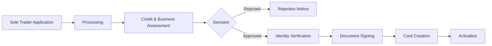

Credit card onboarding for sole traders is the process through which your business customers apply for and receive their credit cards. This involves comprehensive checks and assessments to ensure responsible lending while maintaining a smooth user experience, including additional business verification steps.

## What is Sole Trader Card Onboarding?

Sole trader card onboarding encompasses the entire journey from application to card activation:

1. **Application Submission** - Customer provides personal, financial, and company information
2. **Verification & Assessment** - Automated checks, credit evaluation, and business verification
3. **Agreement Signing** - Digital signing of terms and conditions
4. **Card Issuance** - Physical or virtual card creation
5. **Activation** - Card ready for use

## The Onboarding Journey

## Key Processes

### Application Processing

Initial validation and comprehensive checks including:

- **Application Validation**: Verifying completeness and format of submitted data
- **Internal Checks**: Invoice payment history, block lists, and existing customer records
- **Know Your Customer (KYC)**: PEP screening, sanctions lists
- **Know Your Business (KYB)**: Adverse media screening
- **Credit Assessment**: Schufa integration, Creditsafe business credit checks, income verification, risk scoring
- **Authorization Verification**: Ensuring authorized signatory status

<CardGroup cols={2}>
  <Card title="Business Fraud Detection" icon="shield-halved">
    Enhanced analysis including business patterns and corporate identity verification
  </Card>
  <Card title="AML & KYB Compliance" icon="flag">
    Anti-Money Laundering checks plus Know Your Business verification including adverse media screening
  </Card>
  <Card title="Regulatory Compliance" icon="scale-balanced">
    Adherence to PSD2, GDPR, and local financial regulations plus business-specific requirements
  </Card>
  <Card title="Business Credit Policy" icon="clipboard-check">
    Dual assessment of personal and business creditworthiness for responsible lending
  </Card>
</CardGroup>

<Warning>
Credit assessments are binding for 30 days. Sole traders who are rejected due to credit scoring can reapply after 3 months. Business verification failures may require additional documentation.
</Warning>

### Identity Verification

Once credit and business assessment is approved, customers complete identity verification:

- **Document Verification**: Validation of government-issued IDs
- **Liveness Check**: Ensuring the person is physically present
- **Data Matching**: Verifying information matches official records
- **Signatory Authorization**: Confirming the individual is authorized to sign on behalf of the business

<Info>
Identity verification for sole traders may take slightly longer due to additional business authorization checks, but typically completes within minutes using automated systems.
</Info>

### Document Signing

Once identity verification is completed, sole traders must digitally sign:

- **Credit Agreement**: Terms and conditions for the credit facility
- **Privacy Policy**: Data processing agreements

The signing process uses **Qualified Electronic Signatures (QES)** which provide:
- **Legal Equivalence**: Same legal status as handwritten signatures under eIDAS regulation
- **Non-repudiation**: Cryptographically ensures the signer cannot deny having signed
- **Multi-lingual**: Available in German and English
- **Mobile-Optimized**: Works seamlessly on all devices
- **Regulatory Compliance**: Meets EU standards for financial services

## Application Requirements

### Sole Trader Applicants

**Personal Requirements:**
- Minimum age: 18 years
- EU/EEA residency
- Valid identification document
- Regular income source
- Active email and phone number

**Business Requirements:**
- Registered business in EU/EEA
- Authorized signatory status for the business
- Business registration documents
- Valid VAT number

**Personal Information Collected:**
- Personal details (name, date of birth, nationality)
- Contact information (address, phone, email)
- Employment status and income
- Housing situation (owner/tenant)
- Existing financial obligations

**Company Information Collected:**
- Company name
- Company registration number
- Company city
- VAT number

## Onboarding States

The sole trader onboarding process progresses through several states:

- **PROCESSING**: Initial validation, personal and business checks, KYC/KYB verification, credit assessment
- **AWAITING_SIGNING**: Application approved, waiting for digital signature with signing URL provided
- **AWAITING_CARD_CREATION**: Documents signed, waiting for card creation with credit assessment details
- **COMPLETED**: Onboarding successfully finished with credit engagement established
- **REJECTED**: Application rejected with specific reasons:
  - `KYC_DENIAL`: Failed KYC verification (PEP, sanctions)
  - `CREDIT_SCORING_DENIAL`: Failed personal or business credit scoring
  - `UNAUTHORIZED_SIGNATORY`: Individual is not authorized to sign for the business
- **FAILED**: Unexpected error occurred:
  - `INTERNAL_ERROR`: System error requiring investigation
  - `ADDRESS_MISMATCH`: Address doesn't match official records
  - `NAME_MISMATCH`: Name doesn't match official records
  - `ID_VERIFICATION_FAILED`: Identity verification failed
  - `TIMEOUT`: Process timeout

<Info>
Sole trader applications include enhanced verification steps for business legitimacy and signatory authorization, which may extend processing time but ensure compliance with business lending regulations.
</Info>

Ready to implement? Continue to our [Integration Flow](/card/integration-flow) guide for technical implementation details. 