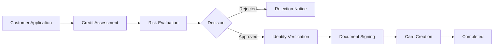

Credit card onboarding is the process through which your customers apply for and receive their credit cards. This involves comprehensive checks and assessments to ensure responsible lending while maintaining a smooth user experience.

## What is Card Onboarding?

Card onboarding encompasses the entire journey from application to card activation:

1. **Application Submission** - Customer provides personal and financial information
2. **Verification & Assessment** - Automated checks and credit evaluation
3. **Agreement Signing** - Digital signing of terms and conditions
4. **Card Issuance** - Physical or virtual card creation
5. **Activation** - Card ready for use

## The Onboarding Journey

## Key Processes

### Risk Management

Throughout the onboarding process, we employ multiple risk controls:

<CardGroup cols={2}>
  <Card title="Fraud Detection" icon="shield-halved">
    Real-time analysis of application patterns and behavioral signals to prevent identity theft
  </Card>
  <Card title="AML Compliance" icon="flag">
    Anti-Money Laundering checks including source of funds verification for high-value applications
  </Card>
  <Card title="Regulatory Compliance" icon="scale-balanced">
    Adherence to PSD2, GDPR, and local financial regulations in all markets
  </Card>
  <Card title="Credit Policy" icon="clipboard-check">
    Consistent application of lending criteria to ensure responsible credit extension
  </Card>
</CardGroup>

### Credit Assessment

For credit card applications, we perform comprehensive creditworthiness evaluation:

- **Credit Bureau Checks**: Integration with Schufa (Germany)
- **Income Verification**: Assessment of stated monthly income
- **Debt-to-Income Ratio**: Calculation of existing financial obligations
- **Payment History**: Review of previous payment behavior with Nordiska
- **Risk Scoring**: Proprietary algorithms for credit limit determination

<Warning>
Credit assessments are binding for 30 days. Customers who are rejected due to credit scoring can reapply after 3 months.
</Warning>

### Identity Verification (KYC)

Know Your Customer (KYC) procedures ensure we're onboarding legitimate customers:

- **Document Verification**: Validation of government-issued IDs
- **PEP Screening**: Checks against Politically Exposed Persons lists
- **Sanctions Screening**: Verification against international sanctions lists
- **Address Verification**: Confirmation of residential address
- **Duplicate Detection**: Preventing multiple applications from same individual

<Info>
KYC checks typically complete within seconds using automated systems, ensuring a frictionless experience for legitimate customers.
</Info>

### Document Signing

Once approved, customers must digitally sign:

- **Credit Agreement**: Terms and conditions for the credit facility
- **SECCI**: Standard European Consumer Credit Information
- **Privacy Policy**: Data processing agreements
- **Fee Schedule**: Transparent pricing information

The signing process is:
- **Legally Binding**: Using qualified electronic signatures
- **Multi-lingual**: Available in German and English
- **Mobile-Optimized**: Works seamlessly on all devices
- **Secure**: Bank-grade encryption and authentication

## Application Requirements

### Individual Applicants

**Basic Requirements:**
- Minimum age: 18 years
- EU/EEA residency
- Valid identification document
- Regular income source
- Active email and phone number

**Information Collected:**
- Personal details (name, date of birth, nationality)
- Contact information (address, phone, email)
- Employment status and income
- Housing situation (owner/tenant)
- Existing financial obligations

Ready to implement? Continue to our [Integration Flow](/card/integration-flow) guide for technical implementation details.