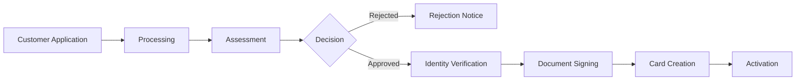

Credit card onboarding is the process through which your customers apply for and receive their credit cards. This involves comprehensive checks and assessments to ensure responsible lending while maintaining a smooth user experience.

## What is Card Onboarding?

Card onboarding encompasses the entire journey from application to card activation:

1. **Application Submission** - Customer provides personal and financial information (plus company details for sole traders)
2. **Verification & Assessment** - Automated checks, credit evaluation, and business verification
3. **Agreement Signing** - Digital signing of terms and conditions
4. **Card Issuance** - Physical or virtual card creation
5. **Activation** - Card ready for use

## API Overview

Our unified API supports both individual and sole trader onboarding through a single endpoint with different `onboardingType` values:

### V2 API Endpoint
```http
POST /api/v2/engagements/card/onboarding
```

### Request Structure
The API uses a discriminator field `onboardingType` to handle different customer types:

<Tabs>
  <Tab title="Individual">
    For individual customers, set `onboardingType` to `"INDIVIDUAL"` and provide:
    - Complete applicant information (personal details, address, employment)
    - Card type selection
    - Redirect URLs for success/failure handling
  </Tab>
  <Tab title="Sole Trader">
    For sole trader customers, set `onboardingType` to `"SOLE_TRADER"` and provide:
    - Complete applicant information (same as individual)
    - **Additional company information** (name, registration number, VAT number, city)
    - Card type selection
    - Redirect URLs for success/failure handling
  </Tab>
</Tabs>

## The Onboarding Journey

Both individual and sole trader applications follow the same state flow:



## Key Processes

### Application Processing

The system performs comprehensive validation and assessment:

<Tabs>
  <Tab title="Individual">
    **Standard Checks:**
    - Application validation (completeness, format)
    - Internal checks (invoice history, block lists)
    - Know Your Customer (KYC) verification
    - Credit assessment (Schufa integration)
    - Income verification and risk scoring
  </Tab>
  <Tab title="Sole Trader">
    **Enhanced Checks:**
    - Application validation (completeness, format)
    - Internal checks (invoice history, block lists)
    - Know Your Customer (KYC) verification
    - **Know Your Business (KYB)** verification
    - **Adverse media screening**
    - Credit assessment (Schufa + **Creditsafe business checks**)
    - **Authorization verification** (signatory status)
    - Income verification and risk scoring
  </Tab>
</Tabs>

<CardGroup cols={2}>
  <Card title="Fraud Detection" icon="shield-halved">
    Real-time analysis of application patterns and behavioral signals to prevent identity theft. Enhanced for sole traders with business pattern analysis.
  </Card>
  <Card title="AML/KYB Compliance" icon="flag">
    Anti-Money Laundering checks for all applicants. Additional Know Your Business verification including adverse media screening for sole traders.
  </Card>
  <Card title="Regulatory Compliance" icon="scale-balanced">
    Adherence to PSD2, GDPR, and local financial regulations. Additional business-specific requirements for sole traders.
  </Card>
  <Card title="Credit Policy" icon="clipboard-check">
    Consistent application of lending criteria. Dual assessment of personal and business creditworthiness for sole traders.
  </Card>
</CardGroup>

<Warning>
  Credit assessments are binding for 30 days. Customers who are rejected due to credit scoring can reapply after 3 months.
</Warning>

### Identity Verification

Once assessment is approved, customers complete identity verification:

- **Document Verification**: Validation of government-issued IDs
- **Liveness Check**: Ensuring the person is physically present
- **Data Matching**: Verifying information matches official records
- **Signatory Authorization** (sole traders): Confirming authorization to sign on behalf of the business

<Info>
  Identity verification typically completes within minutes. Sole traders may take slightly longer due to additional business authorization checks.
</Info>

### Document Signing

Customers must digitally sign required documents:

- **Credit Agreement**: Terms and conditions for the credit facility
- **Privacy Policy**: Data processing agreements

The signing process uses **Qualified Electronic Signatures (QES)** which provide:
- **Legal Equivalence**: Same legal status as handwritten signatures under eIDAS regulation
- **Non-repudiation**: Cryptographically ensures the signer cannot deny having signed
- **Multi-lingual**: Available in German and English
- **Mobile-Optimized**: Works seamlessly on all devices
- **Regulatory Compliance**: Meets EU standards for financial services

## Onboarding States

The onboarding process progresses through defined states:

- **PROCESSING**: Initial validation, KYC/KYB verification, credit assessment
- **AWAITING_SIGNING**: Application approved, waiting for digital signature
- **AWAITING_CARD_CREATION**: Documents signed, waiting for card creation
- **COMPLETED**: Onboarding successfully finished with credit engagement established
- **REJECTED**: Application rejected with specific reasons:
  - `KYC_DENIAL`: Failed KYC verification (PEP, sanctions)
  - `CREDIT_SCORING_DENIAL`: Failed personal or business credit scoring
  - `UNAUTHORIZED_SIGNATORY`: Individual not authorized to sign for business (sole traders only)
- **FAILED**: Unexpected error occurred:
  - `INTERNAL_ERROR`: System error requiring investigation
  - `ADDRESS_MISMATCH`: Address doesn't match official records
  - `NAME_MISMATCH`: Name doesn't match official records
  - `ID_VERIFICATION_FAILED`: Identity verification failed
  - `TIMEOUT`: Process timeout

## Response Structure

All responses include the `onboardingType` discriminator to identify the customer type. The response structure varies based on the onboarding type:

- **Individual responses**: Include applicant information only
- **Sole trader responses**: Include both applicant and company information

Additional information fields are provided based on the current onboarding state (signing URL, credit assessment details, rejection reasons, etc.).

## Getting Started

To begin offering credit cards to your customers:

1. **[Integration Guide](/card/integration-flow)** - Technical integration steps for the unified API
2. **[Webhooks Guide](/card/webhooks)** - Real-time event notifications
3. **[API Reference](/api-reference)** - Complete endpoint documentation

Ready to implement? Continue to our [Integration Flow](/card/integration-flow) guide for technical implementation details.