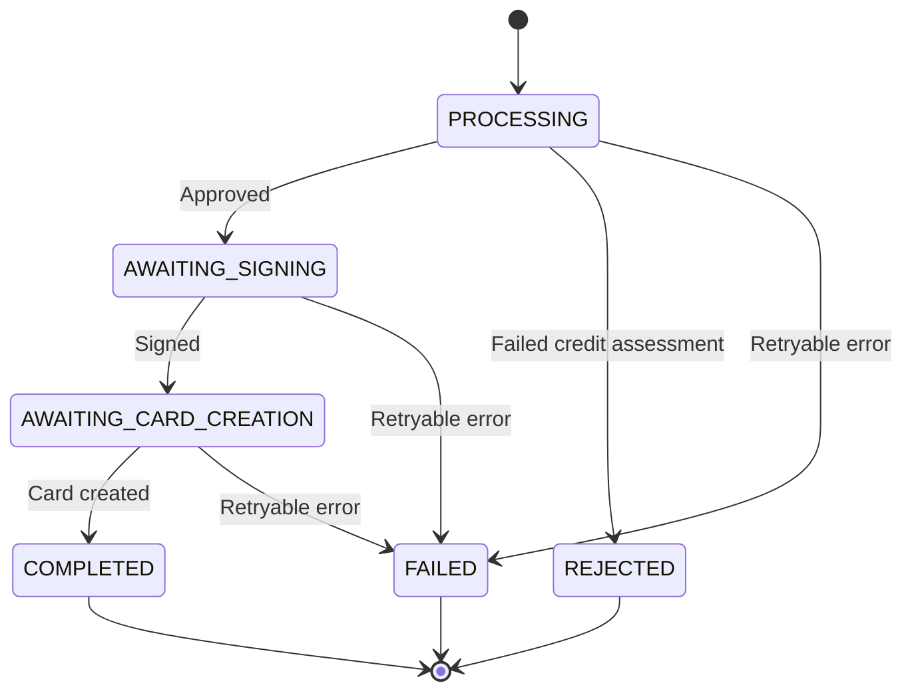

The card onboarding process can be in one of the following states:

## Processing

Initial state when the onboarding request is being processed. This includes:

- Validating the application
- Internal checks (invoice payment history, block lists, etc)
- Conducting KYC (PEP and sanction lists)
- Performing credit checks (Schufa)

## Awaiting signing

The application has been approved and is waiting for the customer to sign the agreement. This state includes:

- A identification and signing URL provided in the `additionalInformation`
- Customer needs to complete the digital signing process

## Awaiting card creation

The application has been signed and is waiting for the card to be created. This state indicates:

- All required documents have been signed
- Partner should proceed to create customer, account, and card in Enfuce
- We will get notified by Enfuce about that the entities have been created and will validate the data
- Credit assessment information is provided in the `additionalInformation`

## Completed

The onboarding process has been successfully finished. This means:

- The card has been created
- The card application has been fully processed
- Credit engagement has been set up
- Credit assessment information is included in the `additionalInformation`

## Rejected

The application has been rejected. The `additionalInformation` will contain one of the following rejection reasons:

- `KYC_DENIAL`: Customer failed KYC verification (PEP, Sanction). Manual handling is needed on Nordiska's side, for example we might need to reach out to the customer for additional information.
- `CREDIT_SCORING_DENIAL`: Customer failed credit scoring requirements. Customer can try apply again in 3 months.

## Failed

An unexpected error occurred during the onboarding process. Create a new onboarding if you want to try again for the user. The `additionalInformation` will contain:

- `INTERNAL_ERROR`: System error that needs investigation
- `ADDRESS_MISMATCH`: The provided address does not match official records
- `NAME_MISMATCH`: The provided name of the customer does not match official records
- `ID_VERIFICATION_FAILED`: Customer's identity verification failed
- `TIMEOUT`: Timeout

## Additional Information

Each status may include additional information in the response. When there is no additional information, the field will be omitted entirely from the response:

<CodeGroup>

```json Processing
{
  "status": "PROCESSING"
}
```


```json Awaiting signing
{
    "status": "AWAITING_SIGNING",
    "additionalInformation": {
        "signingUrl": "https://sign.dev.nordiska.com/123"
    }
}
```


```json Awaiting card creation
{
    "status": "AWAITING_CARD_CREATION",
    "additionalInformation": {
        "creditAssessment": {
            "approvedLimit": {
                "currency": "EUR",
                "amount": 5000,
                "unit": "MINOR"
            },
            "approvedAt": "2025-03-10T18:01:44.216143374Z",
            "validUntil": "2025-04-09T18:01:44.216147184Z"
        }
    }
}
```


```json Completed
{
    "status": "COMPLETED",
    "additionalInformation": {
        "creditAssessment": {
            "approvedLimit": {
                "currency": "EUR",
                "amount": 5000,
                "unit": "MINOR"
            },
            "approvedAt": "2025-03-10T18:01:44.216143374Z",
            "validUntil": "2025-04-09T18:01:44.216147184Z"
        }
    }
}
```


```json Rejected
{
    "status": "REJECTED",
    "additionalInformation": {
        "rejectReason": "KYC_DENIAL"
    }
}
```


```json Failed
{
    "status": "FAILED",
    "additionalInformation": {
        "failureCode": "INTERNAL_ERROR"
    }
}
```

</CodeGroup>

## State Transitions

