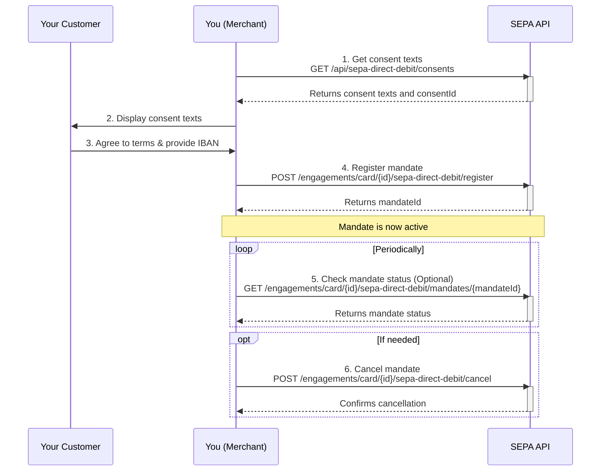

This guide provides an overview of how to integrate with our SEPA Direct Debit API to manage mandates for recurring payments from your customers.

## The Flow

Setting up a SEPA Direct Debit mandate involves a few steps. The customer must first agree to the mandate, after which you can register, manage, and, if necessary, cancel it.

Here is a diagram illustrating the process:



## Step-by-step Guide

### 1. Retrieve Consent Texts

Before you can register a mandate, you must display the necessary legal texts to your customer. You can retrieve these texts from our API. The response will also contain a `consentId` that you will need in the next step.

### 2. Register a Mandate

Once the customer has agreed to the terms and provided their IBAN, you can register the mandate. You'll need the `engagement-id` of the customer, their `iban`, and the `consentId` from the previous step. A successful registration will return a `mandateId`.

### 3. Manage the Mandate

With the `mandateId`, you can retrieve the status and other details of the mandate at any time. You can also cancel the mandate if it is no longer needed.

---

## API Reference

Here are the details for the endpoints that manage SEPA Direct Debit mandates.

### Get SEPA Direct Debit consent texts

Retrieves the legal texts and consents required to set up a SEPA Direct Debit mandate.

<RequestExample>

```bash
curl --request GET \
  --url 'https://api.example.com/api/sepa-direct-debit/consents' \
  --header 'Content-Type: application/json'
```

</RequestExample>

**Response**

A successful request will return a `200 OK` with a JSON body containing the consent texts.

<ResponseExample>

```json
{
  "consentId": "550e8400-e29b-41d4-a716-446655440000",
  "language": "en",
  "texts": [
    {
      "code": "sepa_refund_disclaimer",
      "text": "This refund right is a standard SEPA protection and does not affect your obligation to repay your credit card bill. If you request a refund, your balance will still be due."
    },
    {
      "code": "sepa_legal_text",
      "text": "By authorising this mandate, you allow Bankaktiebolaget Nordiska (publ) to send instructions to your bank to debit your account in accordance with these instructions. You are entitled to a refund from your bank under the terms of your agreement. A refund must be claimed within 8 weeks from the date of debit."
    }
  ],
  "consents": [
    {
      "code": "direct_debit",
      "label": "I authorise Bankaktiebolaget Nordiska (publ) to debit my account via SEPA Direct Debit."
    },
    {
      "code": "pre_notification_waiver",
      "label": "I agree that my monthly statement will serve as advance notice for each SEPA Direct Debit payment."
    }
  ],
  "creditorInformation": {
    "companyName": "Bankaktiebolaget Nordiska (publ)",
    "address": {
      "streetLine1": "Kungsgatan 1",
      "streetLine2": "Box 1234",
      "city": "Stockholm",
      "postalCode": "12345",
      "country": "SE"
    },
    "creditorId": "1234567890"
  }
}
```

</ResponseExample>

---

### Register SEPA Direct Debit

Registers a new SEPA Direct Debit mandate for a given engagement.

<RequestExample>

```bash
curl --request POST \
  --url 'https://api.example.com/api/engagements/card/{engagement-id}/sepa-direct-debit/register' \
  --header 'Content-Type: application/json' \
  --data '{
    "iban": "DE89370400440532013000",
    "consentId": "550e8400-e29b-41d4-a716-446655440000"
  }'
```

</RequestExample>

**Parameters**

| Name            | Type     | In   | Description                             |
| --------------- | -------- | ---- | --------------------------------------- |
| `engagement-id` | `string` | path | **Required**. The ID of the engagement. |

**Request Body**

| Name        | Type     | Description                                                                         |
| ----------- | -------- | ----------------------------------------------------------------------------------- |
| `iban`      | `string` | **Required**. The IBAN of the customer's bank account.                              |
| `consentId` | `string` | **Required**. The ID of the consent obtained from the "Get consent texts" endpoint. |

**Response**

A successful request will return a `200 OK` with a JSON body containing the new mandate ID.

<ResponseExample>

```json
{
  "mandateId": "550e8400-e29b-41d4-a716-446655440001"
}
```

</ResponseExample>

---

### Get SEPA Direct Debit Mandate

Retrieves the details of a specific SEPA Direct Debit mandate.

<RequestExample>

```bash
curl --request GET \
  --url 'https://api.example.com/api/engagements/card/{engagement-id}/sepa-direct-debit/mandates/{mandate-id}' \
  --header 'Content-Type: application/json'
```

</RequestExample>

**Parameters**

| Name            | Type     | In   | Description                                      |
| --------------- | -------- | ---- | ------------------------------------------------ |
| `engagement-id` | `string` | path | **Required**. The ID of the engagement.          |
| `mandate-id`    | `string` | path | **Required**. The ID of the mandate to retrieve. |

**Response**

A successful request will return a `200 OK` with the mandate details.

<ResponseExample>

```json
{
  "mandateId": "550e8400-e29b-41d4-a716-446655440001",
  "iban": "DE89370400440532013000",
  "status": "active",
  "createdAt": "2023-10-26T10:00:00Z",
  "updatedAt": "2023-10-26T10:00:00Z"
}
```

</ResponseExample>

---

### Cancel SEPA Direct Debit

Cancels an active SEPA Direct Debit mandate.

<RequestExample>

```bash
curl --request POST \
  --url 'https://api.example.com/api/engagements/card/{engagement-id}/sepa-direct-debit/cancel' \
  --header 'Content-Type: application/json' \
  --data '{
    "mandateId": "550e8400-e29b-41d4-a716-446655440001"
  }'
```

</RequestExample>

**Parameters**

| Name            | Type     | In   | Description                             |
| --------------- | -------- | ---- | --------------------------------------- |
| `engagement-id` | `string` | path | **Required**. The ID of the engagement. |

**Request Body**

| Name        | Type     | Description                                    |
| ----------- | -------- | ---------------------------------------------- |
| `mandateId` | `string` | **Required**. The ID of the mandate to cancel. |

**Response**

A successful request will return a `200 OK` with the ID of the cancelled mandate.

<ResponseExample>

```json
{
  "mandateId": "550e8400-e29b-41d4-a716-446655440001"
}
```

</ResponseExample>