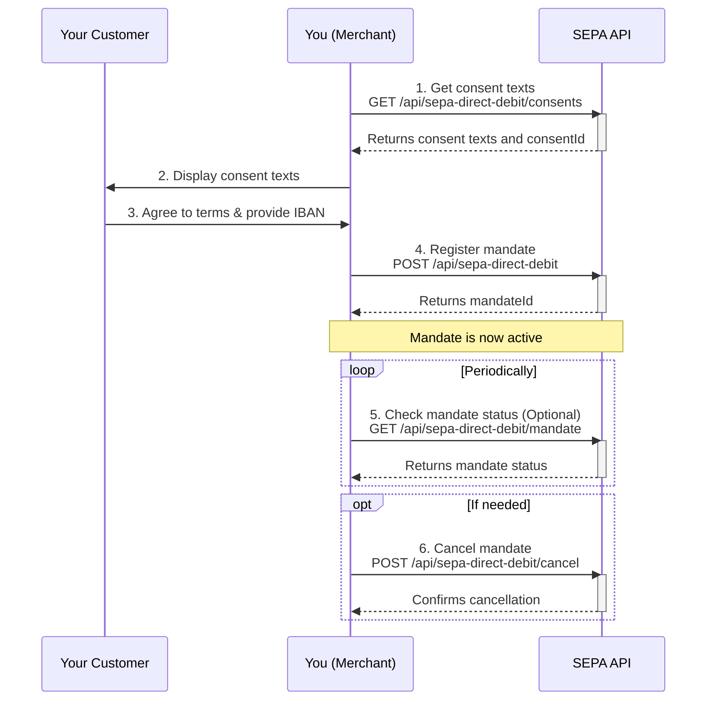

This guide provides an overview of how to integrate with our SEPA Direct Debit API to manage mandates for recurring payments from your customers.

## The Flow

Setting up a SEPA Direct Debit mandate involves a few steps. The customer must first agree to the mandate, after which you can register, manage, and, if necessary, cancel it.

Here is a diagram illustrating the process:

## Step-by-step Guide

### 1. Retrieve Consent Texts

Before you can register a mandate, you must display the necessary legal texts to your customer. You can retrieve these texts from our API. The response will also contain a `consentId` that you will need in the next step.

### 2. Register a Mandate

Once the customer has agreed to the terms and provided their IBAN, you can register the mandate. You'll need their `iban` and the `consentId` from the previous step. A successful registration will return a `mandateId`.

### 3. Manage the Mandate

With the `mandateId`, you can retrieve the status and other details of the mandate at any time. You can also cancel the mandate if it is no longer needed.